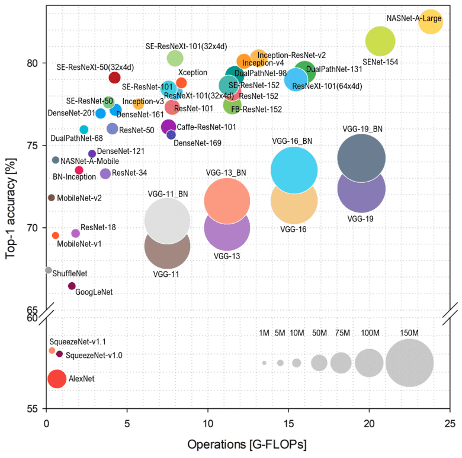

```{r setup, include=FALSE}
# Install necessary packages
#install.packages("gridExtra")
#install.packages("jpeg")
#install.packages("imager")
#install.packages("magick")

# Install Bioconductor package (if not already installed)
#if (!require("BiocManager", quietly = TRUE))
#    install.packages("BiocManager")

# Install EBImage package from Bioconductor
#BiocManager::install("EBImage")
#install.packages("abind")

# Install torch, torchvision, and luz
#install.packages("torch")
#install.packages("torchvision")
#install.packages("luz")

# load packages
library(ggplot2)
library(gridExtra)
library(imager)
library(jpeg)
library(magick)
library(EBImage)
library(grid)
library(dplyr)
library(abind)
library(stringr)
```


## Diagnosing Pneumonia from Chest X-Rays

#### Parsing the data

```{r load_data}
# Specify the path to the zip file
zip_file <- "Practical 3/lab3_chest_xray.zip"

# Specify the destination directory to extract the files
destination_dir <- "Practical 3"

# Extract the zip file
unzip(zip_file, exdir = destination_dir)
```


> Q0)   What is pneumonia and what is the point/benefit of being able to identify it from X-rays automatically?

Pneumonia is a lung disease that is caused by the infection of bacteria, viruses, or fungi. According to the American Lung Association[1], this involves response of inflammations that causes blockage of oxygen carriage through the bloodstream in our body due to the air sacs in lungs being occupied by fluids and pus. In acute cases, it may cause dyspnea that threaten the lives of the patient. Therefore, using X-rays images for automated detection of Pneumonia can help to early diagnose the presence of the associated medical risks, and reduce the rate of mortality by making earlier interventions.


Reference:
[1] American Lung Association. (2022 November 17). Learn About Pneumonia. Avaiable at:  https://www.lung.org/lung-health-diseases/lung-disease-lookup/pneumonia/learn-about-pneumonia


#### Exploring the dataset

```{r path}
data_folder = "lab3_chest_xray/"
files <- list.files(data_folder, full.names=TRUE, recursive=TRUE)

set.seed(42)
#  random sample 20 images
sort(sample(files, 20))
```


> Q1)   Do these filenames tell you anything about pneumonia? Why might this make predicting pneumonia more challenging?

From the random sampled filenames of the image folder, there are two groups, one with the morbidity of pneumonia and one without ("Normal", i.e., control group or negative samples). 
Within Pneumonia, the image was tagged as either "bacteria" or "virus" in the file name, that gives further information about the source or original cause of Pneumonia, which can be split into two types.
This suggests a higher difficulty in predicting pneumonia because different types of pneumonia may have different features, and the available data of each type of pneumonia is relatively limited.
To accurately identify the type of pneumonia, we need more training images from individual types for the model to capture the patterns. Otherwise, we will suffer from an imbalanced class problem.


```{r explore}
# Exploring dataset - number of images 

base_dir <- "lab3_chest_xray"

train_pneumonia_dir <- file.path(base_dir, "train", "PNEUMONIA")
train_normal_dir <- file.path(base_dir, "train", "NORMAL")

test_pneumonia_dir <- file.path(base_dir, "test", "PNEUMONIA")
test_normal_dir <- file.path(base_dir, "test", "NORMAL")

val_normal_dir <- file.path(base_dir, "validate", "NORMAL")
val_pneumonia_dir <- file.path(base_dir, "validate", "PNEUMONIA")

train_pn <- list.files(train_pneumonia_dir, full.names = TRUE)
train_normal <- list.files(train_normal_dir, full.names = TRUE)

test_normal <- list.files(test_normal_dir, full.names = TRUE)
test_pn <- list.files(test_pneumonia_dir, full.names = TRUE)

val_pn <- list.files(val_pneumonia_dir, full.names = TRUE)
val_normal <- list.files(val_normal_dir, full.names = TRUE)

cat("Total Images:", length(c(train_pn, train_normal, test_normal, test_pn, val_pn, val_normal)), "\n")
cat("Total Pneumonia Images:", length(c(train_pn, test_pn, val_pn)), "\n")
cat("Total Normal Images:", length(c(train_normal, test_normal, val_normal)), "\n")
```

####  Creating training datasets

```{r training_dataset}

# Set random seed
set.seed(42)

# Define training, testing, and validation samples
train_dataset <- c(train_pn, train_normal)
train_labels <- c(rep("pneumonia", length(train_pn)), rep("normal", length(train_normal)))

test_dataset <- c(test_pn, test_normal)
test_labels <- c(rep("pneumonia", length(test_pn)), rep("normal", length(test_normal)))

val_dataset <- c(val_pn, val_normal)
val_labels <- c(rep("pneumonia", length(val_pn)), rep("normal", length(val_normal)))

# Create a data frame with the dataset and labels
train_data <- data.frame(dataset = train_dataset, label = train_labels)
test_data <- data.frame(dataset = test_dataset, label = test_labels)
val_data <- data.frame(dataset = val_dataset, label = val_labels)

# Shuffle the data frame
train_data <- train_data[sample(nrow(train_data)), ]
test_data <- test_data[sample(nrow(test_data)), ]
val_data <- val_data[sample(nrow(val_data)), ]

# Extract the shuffled dataset and labels
shuffled_train_dataset <- train_data$dataset
shuffled_train_labels <- train_data$label

shuffled_test_dataset <- test_data$dataset
shuffled_test_labels <- test_data$label

shuffled_val_dataset <- val_data$dataset
shuffled_val_labels <- val_data$label
```

```{r training_dataset_sample}
#showing a file name from test set
cat("file name: ", shuffled_train_dataset[5], "\nlabel: ", shuffled_train_labels[5])
```

####  Data Visualization


```{r visualization}
# Create a list to store the ggplot objects
plots <- list()

# Iterate through the images and labels
for (i in 1:4) {
  
  image <- readImage(shuffled_train_dataset[i])
  
  # Create a ggplot object for the image with the corresponding label
  plot <- ggplot() +
    theme_void() +
    annotation_custom(
      rasterGrob(image, interpolate = TRUE),
      xmin = -Inf, xmax = Inf, ymin = -Inf, ymax = Inf
    )
  
  # Add the ggplot object to the list
  plots[[i]] <- plot
}

# Arrange the plots in a 2x2 grid
grid.arrange(grobs = plots, nrow = 2, ncol = 2)
```

> Q2)   From looking at only 4 images do you see any attribute of the images that we may have to normalise before training a model?

From the 4 images shown above, it is clear that they have different dimensions (widths and heights).
A deep learning model like convolutional neural network (CNN) requires the same input size of the training images, hence the size should be normalized.


####  Data Pre-processing

```{r preprocess_fn}
process_images <- function(shuffled_dataset) {
  
  # Desired image size
  img_size <- 224  
  
  # Initialize an empty list to store processed images
  X <- list()
  
  # Loop through each image path in shuffled_train_dataset
  for (image_path in shuffled_dataset) {
    # Read the image
    img <- imager::load.image(image_path)
    
    # Normalize the image
    img_normalized <- img / 255
    
    # Resize the image
    img_resized <- resize(img_normalized, img_size, img_size)
    
    # Append the processed image to the list
    X <- c(X, list(img_resized))
  }
  
  return(X)
}
```

```{r preprocess}
train_X <- process_images(shuffled_train_dataset)
test_X <- process_images(shuffled_test_dataset)
val_X <- process_images(shuffled_val_dataset)

train_y <- ifelse(shuffled_train_labels == "normal", 1, 2)
test_y <- ifelse(shuffled_test_labels == "normal", 1, 2)
val_y <- ifelse(shuffled_val_labels == "normal", 1, 2)

train_y <- as.integer(train_y)
test_y <- as.integer(test_y)
val_y <- as.integer(val_y)
```


```{r visualize_processed}
# Create a list to store the ggplot objects
plots <- list()

# Iterate through the images and labels
for (i in 1:4) {
  if (train_y[i] == 0) {
    label <- "Normal"
  } else {
    label <- "Pneumonia"
  }
  
  # Create a ggplot object for the image with the corresponding label
  plot <- ggplot() +
    theme_void() +
    ggtitle(label) +
    annotation_custom(
      rasterGrob(train_X[[i]], interpolate = TRUE),
      xmin = -Inf, xmax = Inf, ymin = -Inf, ymax = Inf
    )
  
  # Add the ggplot object to the list
  plots[[i]] <- plot
}

# Arrange the plots in a 2x2 grid
grid.arrange(grobs = plots, nrow = 2, ncol = 2)
```


```{r distributions}
# Combine train, test, and val vectors into a single data frame
df <- data.frame(
  Data = rep(c("Train", "Test", "Val"), times = c(length(train_y), length(test_y), length(val_y))),
  Value = c(train_y, test_y, val_y)
)

# Create a single bar plot with facets
fig <- ggplot(df, aes(x = Value)) +
  geom_bar() +
  ylim(0, 510) +
  facet_wrap(~Data, ncol = 3)

# Arrange the plot
grid.arrange(fig, nrow = 1)

```


> Q3)   If the dataset was not balanced, what kind of techniques could be useful?

There are two techniques that we may consider when training on an imbalanced dataset.

First, we can assign an unequal class weight that gives the rare class samples a heavier weight while the dominant class samples a lower weight.

Second, we may employ methods like oversampling for the minority classes or undersampling for the majority classes.

Third, we may further generate augmented training samples from the minority classes using image processing techniques like flipping, zooming, brightness or contrast enhancement, etc. to balance the ratio of classes.


####  Training

```{r train_prep}
train_X <- array(data = unlist(train_X), dim = c(1000, 224, 224, 1))
test_X <- array(data = unlist(test_X), dim = c(200, 224, 224, 1))
val_X <- array(data = unlist(val_X), dim = c(16, 224, 224, 1))
```

```{r train_prep_output}
cat("Training image dimension : ", dim(train_X))
cat("\n")
cat(paste0("Number of training images : ", length(train_y)))
cat("\n")
cat("Testing image dimension : ", dim(test_X))
cat("\n")
cat(paste0("Number of testing images : ", length(test_y)))
cat("\n")
cat("Validating image dimension : ", dim(val_X))
cat("\n")
cat(paste0("Number of validating images : ", length(val_y)))
```

```{r rearrange_dimensions}
#  reshape the dimension of image arrays

train_X <- aperm(train_X, c(1,4,2,3))
test_X <- aperm(test_X, c(1,4,2,3))
val_X <- aperm(val_X,c(1,4,2,3))

cat("Training image dimension : ", dim(train_X))
```


```{r load_torch}
# Load the torch package
library(torch)
library(torchvision)
library(luz)
```

```{r train_prep_2}
# Define a custom dataset class
ImageDataset <- dataset(
  name = "ImageDataset",
  initialize = function(X, y) {
    # Store the data as tensors
    self$data <- torch_tensor(X)
    self$labels <- torch_tensor(y)
  },
  .getitem = function(i) {
    # Return a single sample and label
    x <- self$data[i,,,]
    y <- self$labels[i]
    list(x = x, y = y)
  },
  .length = function() {
    # Return the number of samples
    dim(self$data)[1]
  }
)

# Create a dataset object from your data
train_dataset <- ImageDataset(train_X, train_y)
test_dataset <- ImageDataset(test_X, test_y)
val_dataset <- ImageDataset(val_X, val_y)

# Create a dataloader object from your dataset
train_dataloader <- dataloader(train_dataset, batch_size = 16)
test_dataloader <- dataloader(test_dataset, batch_size = 16)
val_dataloader <- dataloader(val_dataset, batch_size = 16)

# Iterate over batches of data
batch = train_dataloader$.iter()$.next()

# Visualize the first batch size
batch[[1]]$size()
```

```{r cnn}
net <- nn_module(
  "Net",
  
  initialize = function() {
    self$conv1 <- nn_conv2d(1, 32, 3, 1)
    self$conv2 <- nn_conv2d(32, 64, 3, 1)
    self$dropout1 <- nn_dropout2d(0.25)
    self$dropout2 <- nn_dropout2d(0.5)
    self$fc1 <- nn_linear(774400, 128)        # Adjust the input size based on your image dimensions
    self$fc2 <- nn_linear(128, 2)             # Change the output size to match your classification task
  },
  
  forward = function(x) {
    x %>%                                        # N * 1 * 224 * 224
      self$conv1() %>%                           # N * 32 * 222 * 222
      nnf_relu() %>% 
      self$conv2() %>%                           # N * 64 * 220 * 220
      nnf_relu() %>% 
      nnf_max_pool2d(2) %>%                      # N * 64 * 110 * 110
      self$dropout1() %>% 
      torch_flatten(start_dim = 2) %>%           # N * 64 * 110 * 110 --> N * 774400
      self$fc1() %>%                             # N * 128
      nnf_relu() %>% 
      self$dropout2() %>% 
      self$fc2()                                 # N * 2 (change the output size to match your classification task)
  }
)
```


```{r cnn_train, echo = TRUE, cache = TRUE}
suppressWarnings({

# Set the number of epochs
num_epochs <- 10

train_loss <- numeric(num_epochs)
train_acc <- numeric(num_epochs)
test_loss <- numeric(num_epochs)
test_acc <- numeric(num_epochs)

# Loop through the epochs
for (epoch in 1:num_epochs) {
  # Perform training and validation for each epoch
  fitted <- net %>%
    setup(
      loss = nn_cross_entropy_loss(),
      optimizer = optim_adam,
      metrics = list(
        luz_metric_accuracy()
      )
    ) %>%
    fit(train_dataloader, epochs = 1, valid_data = test_dataloader)
  
  # Print the metrics for the current epoch
  cat("Epoch ", epoch, "/", num_epochs, "\n")
  cat("Train metrics: Loss: ", fitted$records$metrics$train[[1]]$loss, " - Acc: ", fitted$records$metrics$train[[1]]$acc, "\n")
  cat("Valid metrics: Loss: ", fitted$records$metrics$valid[[1]]$loss, " - Acc: ", fitted$records$metrics$valid[[1]]$acc, "\n")
  cat("\n")
  
  # Store the loss and accuracy values
  train_loss[epoch] <- fitted$records$metrics$train[[1]]$loss
  train_acc[epoch] <- fitted$records$metrics$train[[1]]$acc
  test_loss[epoch] <- fitted$records$metrics$valid[[1]]$loss
  test_acc[epoch] <- fitted$records$metrics$valid[[1]]$acc
}

})
```

####  Training Result - plot learning curve

```{r plot_train_curve, echo = TRUE, cache = TRUE}

# Plot the train and test loss
loss_df <- data.frame(
  Epoch = 1:num_epochs,
  Train_Loss = train_loss,
  Test_Loss = test_loss
)
loss_plot <- ggplot(data = loss_df) +
  geom_line(aes(x = Epoch, y = Train_Loss, color = "Train Loss")) +
  geom_line(aes(x = Epoch, y = Test_Loss, color = "Test Loss")) +
  labs(x = "Epoch", y = "Loss") +
  scale_color_manual(values = c("Train Loss" = "blue", "Test Loss" = "red")) +
  theme_minimal()

# Plot the train and test accuracy
acc_df <- data.frame(
  Epoch = 1:num_epochs,
  Train_Accuracy = train_acc,
  Test_Accuracy = test_acc
)
acc_plot <- ggplot(data = acc_df) +
  geom_line(aes(x = Epoch, y = Train_Accuracy, color = "Train Accuracy")) +
  geom_line(aes(x = Epoch, y = Test_Accuracy, color = "Test Accuracy")) +
  labs(x = "Epoch", y = "Accuracy") +
  scale_color_manual(values = c("Train Accuracy" = "blue", "Test Accuracy" = "red")) +
  theme_minimal()

# Print the plots
print(loss_plot)
print(acc_plot)
```


> Q4)  Based on the training and test accuracy, is this model actually managing to classify X-rays into pneumonia vs normal? What do you think contributes to this? why?

After training for 10 epochs, the training, validation, and testing accuracy fluctuates around 0.5 (probability of random guess), which means the model was not learning and failed to classify the X-rays images of pneumonia patients against normal samples. 
As the training loss does not decrease gradually, this is a sign of under-fitting that did not learn well even for the training samples. There may be several reasons for this:

1) The model structure may not be complex enough to extract the latent features that are useful for discerning the binary-class images. 
   This can be attributed to a lack of layer depth (only 2 convolution layers), and oversimplified operation of flattening the image pixel features into a long latent embedding followed by reduction of dimensionality with only 1 feed-forward dense layer.

2) The training images may not be representative enough, or too few images were inputted for training, which limits the model predictability by fitting to the noises in the images.

3) The learning rate may be too high (default = 0.001), and given a small sample size (1000 training images), the model may fail to search for optimal values gradually but making large magnitudes of loss value update per step causing fluctuations.


> Q5)  What is your suggestions to solve this problem? How could we improve this model?

To further improve the model performance, we can consider the following aspects:

1) Adding more convolution layers to extract the localized image features more effectively.

2) Adding more training samples by collecting more raw data or data augmentation, 1000 images is still considered a small training sample for CNN or image classification problem.

3) Adding a max-pooling layer (or doing a stride) per each convolution layer, because each convolution layer increases the dimensionality significantly with a stack of sliding kernels/filters, downsampling (pooling) operation can reduce the dimensionality to alleviate overfitting.

4) Adding a batch normalization layer between each convolution or feed-forward (dense) layers, because this can ensure the outputs from an intermediate layer is normalized before feeding to a subsequent layer, minimizing the change or variation in distributions. 

5) Experimenting with adaptive learning rates, because the learning process is steeper during the beginning, at later stage, if the learning rate is too high, the model cannot search the optimal values of the gradient descent and tends to fluctuate.


####  Data Augmentation

```{r augmentation}
img <- EBImage::readImage(paste0('./', shuffled_train_dataset[5]))

T_img <- torch_squeeze(torch_tensor(img)) %>% 
        # Randomly change the brightness, contrast and saturation of an image
        transform_color_jitter() %>%
        # Horizontally flip an image randomly with a given probability
        transform_random_horizontal_flip() %>%
        # Vertically flip an image randomly with a given probability
        transform_random_vertical_flip(p = 0.5)

image(as.array(T_img))
```


```{r transform}
# Define a custom dataset class with transformations
ImageDataset_augment <- dataset(
  name = "ImageDataset",
  initialize = function(X, y, transform = NULL) {
    self$transform <- transform
    self$data <- X
    self$labels <- y
  },
  .getitem = function(i) {
    # Return a single sample and label
    x <- self$data[i,,,]
    x <- self$transform(x)
    y <- self$labels[i]
    
    list(x = x, y = y)
  },
  .length = function() {
    dim(self$data)[1]
  }
)

# Define the transformations for training data
train_transforms <- function(img) {
  img <- torch_squeeze(torch_tensor(img)) %>%
    transform_color_jitter() %>%
    transform_random_horizontal_flip() %>%
    transform_random_vertical_flip(p = 0.5) %>%
    torch_unsqueeze(dim = 1)
  
  return(img)
}

# Apply the transformations to your training dataset
train_dataset <- ImageDataset_augment(train_X, train_y, transform = train_transforms)
test_dataset <- ImageDataset(test_X, test_y)
val_dataset <- ImageDataset(val_X, val_y)

# Create a dataloader for training
train_dataloader <- dataloader(train_dataset, batch_size = 16)
test_dataloader <- dataloader(test_dataset, batch_size = 16)
val_dataloader <- dataloader(val_dataset, batch_size = 16)

# Iterate over batches of data
batch = train_dataloader$.iter()$.next()

# Visualize the first batch size
batch[[1]]$size()
```

> Q6)  What are the potential drawbacks or disadvantages of data augmentation?

We may not be certain if the samples generated from these image processing based data augmentation techniques are appropriate.


Sometimes, it may increase the risk of overfitting if the available training samples are not representative or diverse enough to cover all possible variations in the data.
Although it produces more samples for the models to better generalize the patterns, Augmented images still consist of similar features.
The model's performance would still be ineffective to predict images with unseen features attributed to pneumonia.


Sometimes, it may introduce noises or perplexity if the changes in brightness, positions, orientations, etc. of the objects are some of the features that can classify between the outcomes.


####  Mobile Net

> Q7)  What is ImageNet aka “ImageNet Large Scale Visual Recognition Challenge 2012”? How many images and classes does it involve? Why might this help us?

ImageNet in 2012 refers to a Computer Vision competition held to seek for the best-performing model(s) that could automatically classify an image into categories or labels describing the contents of the image.
The competition's training dataset involved 10,000,000 annotated images from 10,000 classes. The validation and testing dataset consist of 150,000 images from 1,000 classes.
This dataset can be a good source for finding similar X-rays images that may not be associated with the presence of pneumonia, which can be served as negative samples.
On the other hand, the award-winning models can be used for transfer learning to boost the speed of the model training in a domain-specific problem as the model structure has proven to be successful.


Reference:  

[2] ImageNet Large Scale Visual Recognition Challenge 2012 (ILSVRC2012) official website: https://image-net.org/challenges/LSVRC/2012/


> Q8)  Why do you think using this architecture in this practical assignment can help to improve the results? Hint: See MobileNet publication

MobileNet has two major achievements.


1) As from version 1, it contains a certain depth of layers (14 blocked layers) while maintaining the efficiency of computation by a design called "Depth-wise Separable Convolution". 

   Instead of doing fully convolutions for the input channels together (No. of channels x No. of filters), it does separately for each channel (depth-wise convolution). This saves parameters (less matrix multiplications) while still being able to learn channel-specific features.
   
   Then, a 1 x 1 convolution filter is assigned to slide over each pixel to project the extracted features to a higher dimension (point-wise convolution). This ensures the capability of the model to learn localized patterns through linear combination of the channel embeddings.
   
2) As for version 2, besides the "Depth-wise Separable Convolution" block, it integrates the "residual" operation concept such that another type of block passes the input values (short-cut) to add to the convoluted output of the 3 x 3 and 1 x 1 convolution layers.

   This borrows the advantage from residual connection, which was found to be able to stabilize the gradient propagating through a deep neural network with multiple layers. 
   Moreover, this residual connection is inverted (starting from depth-wise output, expanding to higher dimension through convolution, then back to lower dimension), 
   which better prevents the loss of channel-specific information as in "ReLU" activation (discarding activated values less that or equal to zero).
   

When applied to the pneumonia classification problem, it helps to perform more efficient training saving time cost, and more effective learning by preserving and propagating features for each pixel positions across latent encoded / embedded depths.


References:

[3] Howard, Andrew G., Menglong Zhu, Bo Chen, Dmitry Kalenichenko, Weijun Wang, Tobias Weyand, Marco Andreetto, and Hartwig Adam. (2017). "Mobilenets: Efficient convolutional neural networks for mobile vision applications." arXiv preprint arXiv:1704.04861. https://arxiv.org/abs/1704.04861

[4] Sandler, M., Howard, A., Zhu, M., Zhmoginov, A., & Chen, L. C. (2018). "Mobilenetv2: Inverted residuals and linear bottlenecks." In Proceedings of the IEEE conference on computer vision and pattern recognition (pp. 4510-4520). https://arxiv.org/abs/1801.04381v4


> Q9)  How many parameters does this network have? How does this compare to better performing networks available in torch?
   
MobileNet v1 has 4.2 million parameters and MobileNet v2 reduces this to 3.4 millions. 

Below figure shows the benchmarking performance of convolutional neural networks using the ImageNet validation set [5], MobileNet v2 is among the top in terms of implementation or operational efficiency. 
However, in terms of top-1 prediction accuracy, it just has a fair performance compared to other well-performing models like DenseNet and ResNet.

Based on the following table provided by PyTorch documentation [6], MobileNet v2 ranks the 18th in terms of error rate of top-1 prediction on the 1-crop validation set of ImageNet.
It generally beats older models like VGG-Net, but being inferior to DenseNet, Inception, ResNet. This list did not include some newer models like Vision Transformer (ViT) that may even perform better in recent years.


Reference:

[5]  Bianco, S., Cadene, R., Celona, L., & Napoletano, P. (2018). Benchmark analysis of representative deep neural network architectures. IEEE access, 6, 64270-64277. https://arxiv.org/abs/1810.00736

[6]  https://pytorch.org/vision/0.8/models


Rank	| Network	           |  Top-1 error	| Top-5 error |
------| -------------------|--------------|-------------|
1	    | ResNeXt-101-32x8d	 | 20.69	      |  5.47       |
2	    | Wide ResNet-101-2	 | 21.16	      |  5.72       |
3	    | Wide ResNet-50-2	 | 21.49	      |  5.91       |
4	    | ResNet-152	       | 21.69	      |  5.94       |
5	    | Densenet-161	     | 22.35	      |  6.20       |
6	    | ResNeXt-50-32x4d	 | 22.38	      |  6.30       |
7	    | Inception v3	     | 22.55	      |  6.44       |
8	    | ResNet-101	       | 22.63	      |  6.44       |
9	    | Densenet-201	     | 22.80	      |  6.43       |
10	  | ResNet-50	         | 23.85	      |  7.13       |
11	  | Densenet-169	     | 24.00	      |  7.00       |
12	  | Densenet-121	     | 25.35	      |  7.83       |
13	  | VGG-19 with BN     | 25.76	      |  8.15       |
14	  | MNASNet 1.0	       | 26.49	      |  8.46       |
15	  | VGG-16 with BN     | 26.63	      |  8.50       |
16	  | ResNet-34	         | 26.70	      |  8.58       |
17	  | VGG-19	           | 27.62	      |  9.12       |
18	  | MobileNet V2	     | 28.12	      |  9.71       |       
19	  | VGG-16	           | 28.41	      |  9.62       |
20	  | VGG-13 with BN	   | 28.45        |	 9.63       |
21	  | VGG-11 with BN	   | 29.62	      |  10.19      |
22	  | VGG-13	           | 30.07	      |  10.75      |
23	  | GoogleNet	         | 30.22	      |  10.47      |
24	  | ResNet-18	         | 30.24	      |  10.92      |
25	  | ShuffleNet V2	     | 30.64	      |  11.68      |
26	  | VGG-11	           | 30.98	      |  11.37      |
27	  | SqueezeNet 1.1	   | 41.81	      |  19.38      |
28	  | SqueezeNet 1.0	   | 41.90	      |  19.58      |
29	  | AlexNet	           | 43.45	      |  20.91      |


```{r, out.width = "400px"}

```


> Q10)  Using the provided materials in this practical, train a different network architecture. Does this perform better?

Using the MobileNet-v2 architecture, I trained another 10 epochs on the updated datasets after augmentation. 
To adapt for the 3-channel input dimension of MobileNet-v2, we may convert the grayscale image to RGB image. However, it may be arguable to replicate the pixel values as the raw images do not naturally contain information or visual variations represented by colors.
Another approach to consider here is to add a 1 x 1 convolution layer outputting 3 channels, making this change in number of channels also part of the neural network as learnable parameters.


For the results, the training loss curve is decreasing per each epoch, this is a sign of the model starting to learn from the data and optimize the loss function for the classification task. Therefore, it shows the model has made improvements.
However, the accuracy is still fluctuating around 0.5 which may further imply the following arguments/discussions: 

i)  The problem is difficult, especially we have two different types of pneumonia.

ii)  MobileNet-v2 is trained for general purpose that deals with images from over thousands of object categories, its weightings are not optimized for pneumonia detection. 

iii)  Augmentation of images does not help much in this case and the 1,000 raw images may not be sufficiently diverse to make successful classification.

iv)  The learning rate is a problem, slowing it down may help it progress better to have continuously gradual decrease in losses and increase in accuracy.

v)  10 epochs are too few for training a good model, we need hundreds, thousands, and even ten thousands of epochs to achieve an industry-standard model.

vi)  The validation set is too small relative to the training set, only 1.6% of the size of the training set, this will probably cause oscillating validation loss and accuracy across the training process.


```{r wrap_mobilnet, echo = TRUE, cache = TRUE}
##  Adaptation with reference to the source code of MobileNet v2: 
##  https://rdrr.io/github/mlverse/torchvision/src/R/models-mobilenetv2.R

# load model module
mobilenet <- model_mobilenet_v2(pretrained = TRUE)
# get defaulted dimension in the last layer
out_channel = mobilenet$last_channel

# wrap MobileNet_v2 into a torch nn module
mobilenet_wrap <- nn_module(
  "Net",
  initialize = function() {
    ### add a 1 x 1 convolution layer to convert the grayscale (1 channel) to RGB (3 channels) as the defaulted size of input in MobileNet v2 
    self$conv1 <- nn_conv2d(1, 3, 1, 1)
    ### pass to the pre-trained model
    self$model <- mobilenet
    self$model$classifier <- nn_linear(out_channel, 2)
  },
  forward = function(x) {
    x = self$conv1(x)
    x = self$model(x)
  }
)
```


```{r mobilenet_train, echo = TRUE, cache = TRUE}
suppressWarnings({

# Set the number of epochs
num_epochs <- 10

train_loss <- numeric(num_epochs)
train_acc <- numeric(num_epochs)
test_loss <- numeric(num_epochs)
test_acc <- numeric(num_epochs)

# Loop through the epochs
for (epoch in 1:num_epochs) {
  # Perform training and validation for each epoch
  fitted <- mobilenet_wrap %>%
    setup(
      loss = nn_cross_entropy_loss(),
      optimizer = optim_adam,
      metrics = list(
        luz_metric_accuracy()
      )
    ) %>%
    fit(train_dataloader, epochs = 1, valid_data = test_dataloader)
  
  # Print the metrics for the current epoch
  cat("Epoch ", epoch, "/", num_epochs, "\n")
  cat("Train metrics: Loss: ", fitted$records$metrics$train[[1]]$loss, " - Acc: ", fitted$records$metrics$train[[1]]$acc, "\n")
  cat("Valid metrics: Loss: ", fitted$records$metrics$valid[[1]]$loss, " - Acc: ", fitted$records$metrics$valid[[1]]$acc, "\n")
  cat("\n")
  
  # Store the loss and accuracy values
  train_loss[epoch] <- fitted$records$metrics$train[[1]]$loss
  train_acc[epoch] <- fitted$records$metrics$train[[1]]$acc
  test_loss[epoch] <- fitted$records$metrics$valid[[1]]$loss
  test_acc[epoch] <- fitted$records$metrics$valid[[1]]$acc
}
})
```


```{r mobilenet_plot_train_curve, echo = TRUE, cache = TRUE}

# Plot the train and test loss
loss_df <- data.frame(
  Epoch = 1:num_epochs,
  Train_Loss = train_loss,
  Test_Loss = test_loss
)
loss_plot <- ggplot(data = loss_df) +
  geom_line(aes(x = Epoch, y = Train_Loss, color = "Train Loss")) +
  geom_line(aes(x = Epoch, y = Test_Loss, color = "Test Loss")) +
  labs(x = "Epoch", y = "Loss") +
  scale_color_manual(values = c("Train Loss" = "blue", "Test Loss" = "red")) +
  theme_minimal()

# Plot the train and test accuracy
acc_df <- data.frame(
  Epoch = 1:num_epochs,
  Train_Accuracy = train_acc,
  Test_Accuracy = test_acc
)
acc_plot <- ggplot(data = acc_df) +
  geom_line(aes(x = Epoch, y = Train_Accuracy, color = "Train Accuracy")) +
  geom_line(aes(x = Epoch, y = Test_Accuracy, color = "Test Accuracy")) +
  labs(x = "Epoch", y = "Accuracy") +
  scale_color_manual(values = c("Train Accuracy" = "blue", "Test Accuracy" = "red")) +
  theme_minimal()

# Print the plots
print(loss_plot)
print(acc_plot)
```


